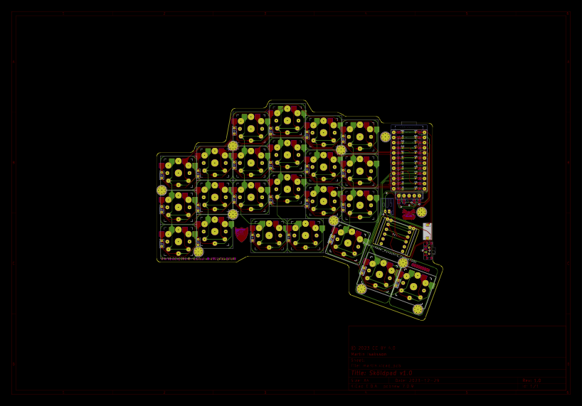

# Sköldpad 1.0

A split, columnar-staggered keyboard with a rotary encoder and a nice!view display, laid out with
[ergogen](https://github.com/ergogen/ergogen) and routed in KiCad. It's based on/inspired by
[josukey](https://github.com/Narkoleptika/josukey) (MIT licensed), an ergogen-based Corne clone.

Firmware ([ZMK](https://zmk.dev/), with a custom keymap tuned for Swedish input and coding
symbols) lives in its own repo: **[martisak/zmk-config](https://github.com/martisak/zmk-config)**.

## Renders

<p align="center">
    
    
</p>
<p align="center">
    
    
</p>

## Prerequisites

* Node
* KiCad (to open/edit the PCB)

## Getting Started

```bash
git clone https://github.com/martisak/skoldpad.git
cd skoldpad
npm i
```

## Ergogen

The layout lives in `ergogen/config.yaml`.

### Build

Runs Ergogen and builds all of the output files (outlines, case, PCB skeleton) into `ergogen/output`.

```bash
npm run ergogen:build
```

### Watch

Watches `config.yaml` and the `footprints` directory and re-runs the build on changes.

```bash
npm run ergogen:watch
```

## KiCad

The hand-routed PCB lives at [`ergogen/kicad/skoldpad.kicad_pcb`](./ergogen/kicad/skoldpad.kicad_pcb)
(along with the schematic, 3D step model, and the custom `Signature.pretty` footprint library it
depends on) — open `ergogen/kicad/skoldpad.kicad_pro` in KiCad.

<p align="center">
    
</p>

## Firmware

Firmware and keymap are maintained separately at
[martisak/zmk-config](https://github.com/martisak/zmk-config):

```bash
git clone git@github.com:martisak/zmk-config.git
```

It's a `nice_nano_v2` ZMK build with its own keymap (not based on Miryoku), tuned for the
macOS Swedish layout — base layer plus NUM, FUNC, and directional layers. Builds run in
GitHub Actions on every push; grab the `.uf2` artifacts from the latest successful run.

## Case

<p align="center">
    
</p>

The case is designed in Shapr3D and 3D printed; the model itself isn't exported/published here yet.

## Thanks

* <a href="https://github.com/ergogen/ergogen" target="_blank">Ergogen</a>
* <a href="https://discord.gg/nbKcAZB" target="_blank">Absolem Club Discord</a>
* <a href="https://github.com/tsteffek/Ergogen-V4-Migration-Guide" target="_blank">V4 Migration Guide</a>
* <a href="https://gitlab.com/Audijo/keyboard" target="_blank">Claw</a>
* <a href="https://github.com/MrCarney/mrkeyboard" target="_blank">MrKeyboard</a>
* <a href="https://github.com/foostan/crkbd" target="_blank">Corne keyboard</a>
* <a href="https://github.com/zmkfirmware/zmk" target="_blank">ZMK</a>
* <a href="https://github.com/Narkoleptika/josukey" target="_blank">josukey</a> — the base this board started from
