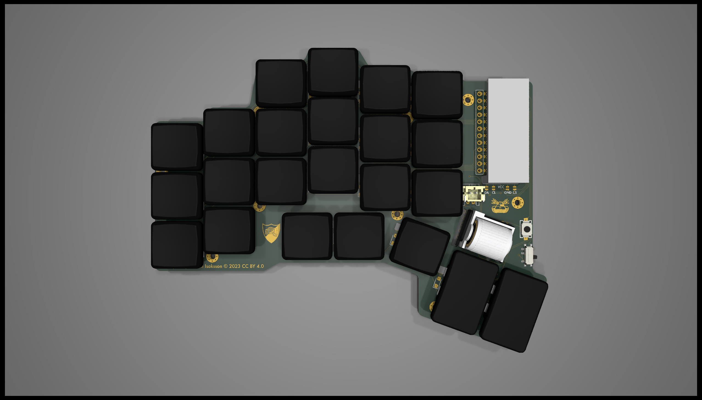
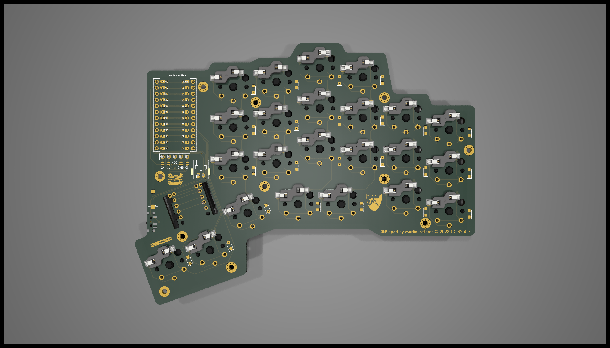
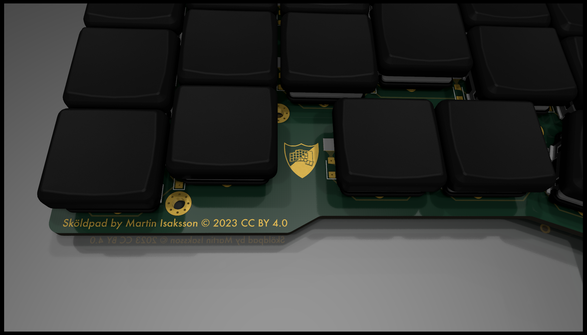
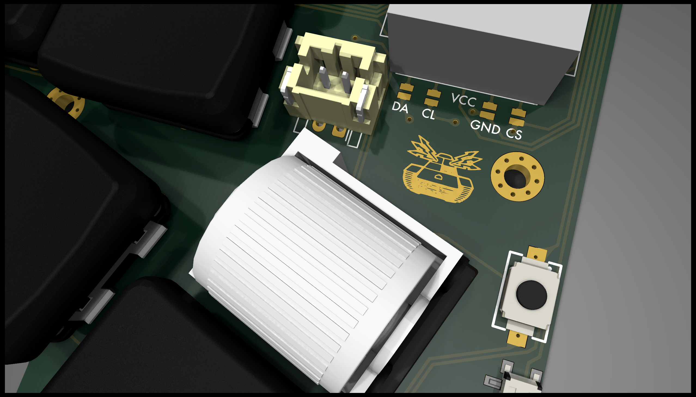
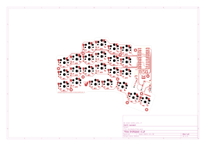

<p align="center">
  <picture>
    <source media="(prefers-color-scheme: dark)" srcset="./images/header-white.svg">
    <source media="(prefers-color-scheme: light)" srcset="./images/header-black.svg">
    
  </picture>
</p>

A split, columnar-staggered keyboard built around a
[nice!nano](https://nicekeyboards.com/nice-nano/) MCU with a rotary encoder, laid out with
[ergogen](https://github.com/ergogen/ergogen) and routed in KiCad. It's based on/inspired by
[josukey](https://github.com/Narkoleptika/josukey) (MIT licensed), an ergogen-based Corne clone.

Firmware ([ZMK](https://zmk.dev/), with a custom keymap tuned for Swedish input and coding
symbols) lives in its own repo: **[martisak/zmk-config](https://github.com/martisak/zmk-config)**.

## Renders

<p align="center">
    
    
</p>
<p align="center">
    
    
</p>

## Prerequisites

* Node
* KiCad (to open/edit the PCB)

## Getting Started

```bash
git clone https://github.com/martisak/skoldpad.git
cd skoldpad
npm i
```

## Ergogen

The layout lives in `ergogen/config.yaml`.

### Build

Runs Ergogen and builds all of the output files (outlines, case, PCB skeleton) into `ergogen/output`.

```bash
npm run ergogen:build
```

### Watch

Watches `config.yaml` and the `footprints` directory and re-runs the build on changes.

```bash
npm run ergogen:watch
```

## KiCad

The hand-routed PCB lives at [`ergogen/kicad/skoldpad.kicad_pcb`](./ergogen/kicad/skoldpad.kicad_pcb)
(along with the schematic, 3D step model, and the custom `Signature.pretty` footprint library it
depends on) — open `ergogen/kicad/skoldpad.kicad_pro` in KiCad.

<p align="center">
  <picture>
    <source media="(prefers-color-scheme: dark)" srcset="./images/schematic-dark.svg">
    <source media="(prefers-color-scheme: light)" srcset="./images/schematic-light.svg">
    
  </picture>
</p>

Regenerate these from the routed board with `make schematics` (requires `kicad-cli` and Python 3
on `PATH`); see the [`Makefile`](./Makefile).

## Firmware

Firmware and keymap are maintained separately at
[martisak/zmk-config](https://github.com/martisak/zmk-config):

```bash
git clone git@github.com:martisak/zmk-config.git
```

It's a [nice!nano](https://nicekeyboards.com/nice-nano/) ZMK build with its own keymap (not
based on Miryoku), tuned for the macOS Swedish layout — base layer plus NUM, FUNC, and
directional layers. Builds run in GitHub Actions on every push; grab the `.uf2` artifacts from
the latest successful run.

The PCB footprints support a [nice!view](https://nicekeyboards.com/nice-view) display — this
should work but hasn't been tested yet.

## Case

<p align="center">
    
</p>

The case is designed in [Shapr3D](https://app.shapr3d.com/p/ba8f4a1e-6f99-4bed-8f1e-6df41bfcee0b)
(viewable in 3D at that link) and 3D printed. STL files for both halves (top and bottom shells)
are in [`case/`](./case):

* [`case/left.stl`](./case/left.stl) / [`case/left_top.stl`](./case/left_top.stl)
* [`case/right.stl`](./case/right.stl) / [`case/right_top.stl`](./case/right_top.stl)

## Bill of Materials

Quantities below are **per half**; this design is one hand's PCB, fabricated twice (one
normal, one mirrored) for a complete pair — double everything for a full two-hand build.

**This PCB is Choc v1 (PG1350) only.** The switch footprint's center hole and stabilizer-leg
positions don't match Choc v2 or MX, so neither is a drop-in substitution — see Future Work.

| Part | Qty/half | Notes |
|---|---:|---|
| [nice!nano](https://nicekeyboards.com/nice-nano/) | 1 | MCU, one per half (each half is an independent BLE unit) |
| [nice!view](https://nicekeyboards.com/nice-view) | 1 | Display — **untested**, see Known Issues; optional |
| Panasonic EVQWGD001 rotary encoder | 1 | ⚠️ Discontinued by Panasonic — check old-stock listings (e.g. [Jotrin](https://www.jotrin.com/product/parts/EVQWGD001)) or plan to substitute a pin-compatible EVQW-series encoder |
| Kailh Choc v1 switch | 23 | See Future Work — v2 is the recommended switch going forward |
| Kailh PG1350 hotswap socket | 23 | Choc v1 hotswap socket, e.g. [Chosfox](https://chosfox.com/products/kailh-choc-switch-1350-hot-swap-sockets) |
| SOD-123W diode (e.g. 1N4148W) | 23 | Standard keyboard-matrix switching diode |
| JST PH 2-pin connector (S2B-PH-K, 2.0mm) | 1 | Battery connector |
| LiPo battery (JST PH 2-pin) | 1 | Capacity not specified by the design — pick to fit the case |
| Kailh PCM12 SPDT slide switch | 1 | Power on/off |
| Würth WS-TASV SMT tactile switch ([434121025816](https://www.digikey.com/en/products/detail/w%C3%BCrth-elektronik/434121025816/5209078)) | 1 | Reset button |
| M2 screws + threaded inserts/standoffs | 11 sets | One per mounting point in `config.yaml` (`screw_*` positions) |
| 1u keycap (Choc profile) | 21 | |
| 1.5u keycap (Choc profile) | 2 | Thumb keys — see Known Issues re: rotation |

Not in the PCB itself but needed to finish a build: the 3D-printed case (see Case section
above) and a filament of your choice.

## Known Issues

* The two thumb keys should be rotated to accept a 1.5u keycap, as shown in the renders.
* nice!view support is untested — should work per the footprint, but not confirmed on hardware.
* The case's screw posts are thin and prone to cracking when installing the threaded inserts
  (see Bill of Materials — M2 screws + threaded inserts/standoffs); consider thickening the
  posts in the Shapr3D model or heat-setting inserts more carefully.

## Future Work

* Move to Choc v2 switches — currently on v1, which has a smaller center post than v2.
* Test compatibility with full-size MX switches.
* Test nice!view once one arrives (currently on order).
* Update the BOM's rotary encoder — the specified Panasonic EVQWGD001 is discontinued;
  find and validate a pin-compatible replacement.
* Consider per-key LEDs instead of underglow — underglow would need a transparent case,
  which the current 3D-printed design isn't.

## License

Code (footprint generator scripts, build tooling) is [MIT](./LICENSE). The
hardware design (PCB, schematic, case, and ergogen layout) is
[CERN-OHL-P v2](./LICENSE-HARDWARE).

## Thanks

* <a href="https://github.com/ergogen/ergogen" target="_blank">Ergogen</a>
* <a href="https://discord.gg/nbKcAZB" target="_blank">Absolem Club Discord</a>
* <a href="https://github.com/tsteffek/Ergogen-V4-Migration-Guide" target="_blank">V4 Migration Guide</a>
* <a href="https://gitlab.com/Audijo/keyboard" target="_blank">Claw</a>
* <a href="https://github.com/MrCarney/mrkeyboard" target="_blank">MrKeyboard</a>
* <a href="https://github.com/foostan/crkbd" target="_blank">Corne keyboard</a>
* <a href="https://www.youtube.com/watch?v=dg2TT1OJlQs" target="_blank">Ben Vallack</a>
* <a href="https://github.com/zmkfirmware/zmk" target="_blank">ZMK</a>
* <a href="https://github.com/Narkoleptika/josukey" target="_blank">josukey</a> — the base this board started from
* <a href="https://sv.wikipedia.org/wiki/V%C3%A4sterg%C3%B6tlands_landskapsvapen" target="_blank">Västergötlands landskapsvapen</a> — inspiration for the logo
* <a href="https://fonts.google.com/specimen/Chakra+Petch" target="_blank">Chakra Petch</a> — typeface used for PCB text and case engraving

## AI Disclosure

Claude (Anthropic) assisted with README and documentation polish — drafting and formatting
text (including the BOM table and general presentation of this repo) from the author's own
notes and decisions. The design, PCB, firmware, fabrication work, and content substance
(including Known Issues and Future Work) are the author's own.
